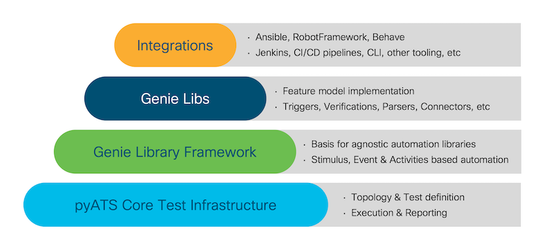
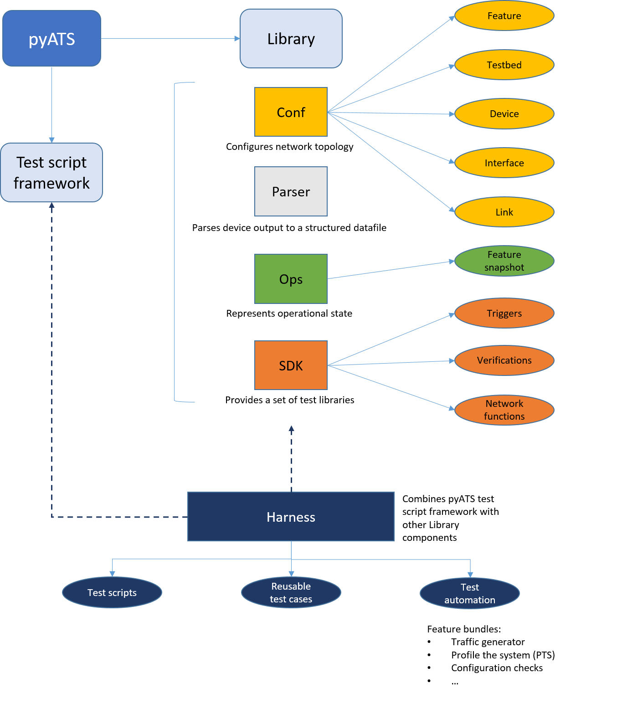

Introduction
=============================

This topic provides a high-level view of the |pyATS| ecosystem and describes how it helps you to automate your network operations and testing.

What is the |pyATS| ecosystem?
-------------------------------------
|pyATSbold| and the |librarybold| together define an ecosystem that streamlines and standardizes how you set up and run automated network tests. |pyATS| and the |library| provide sanity, feature, solution, system, and scale test automation for any type of device or virtual device. |pyATS| is currently used with devices such as routers and switches, access points, firewalls, Linux servers, phones, cable CPEs, and many more.

Originally developed for internal Cisco engineers, the |pyATS| ecosystem is at the core of Cisco's Test Automation Solution. It's currently used

* by more than **3500** internal Cisco engineers and developers
* with over **2000** downloads per month,
* for more than **2 million** test runs every month.

The |pyATS| ecosystem empowers your team to create and run consistent, repeatable, iterative, and reusable tests. |pyATS| provides the test framework, and the |library| offers ready-to-use test components.

.. tip:: The |pyATS| ecosystem is available under Apache License Version 2.0

The following diagram describes the ecosystem in more detail.

The |pyATS| ecosystem can learn and profile an entire feature's configuration and operational status. For example, with just a few commands, you can profile your system before and after a configuration change and get a detailed summary of exactly what changed.

What is |pyATS|?
^^^^^^^^^^^^^^^^
|pyATS| is the test framework foundation for the ecosystem. |pyATS| specializes in data-driven and reusable testing for Agile, rapid development iterations.

This powerful, highly-pluggable |python_reg| framework enables developers to start with small, simple and linear test cases, and then scale up to large, complex and asynchronous test suites.

What is the |library|?
^^^^^^^^^^^^^^^^^^^^^^
The |library| provides all the tools needed for network test automation, including

* a pool of reusable :term:`parsers <Parser>`
* a pool of reusable :term:`triggers <Trigger>`
* a pool of reusable APIs
* a simple :term:`command line interface <Library command line>` (no Python knowledge needed)
* many more useful libraries

.. _genie-cli:

What is the |library| CLI?
^^^^^^^^^^^^^^^^^^^^^^^^^^
.. include:: ../definitions/def_genie_cli.rst

When you want to use the CLI, you simply type::

 (pyats) $ genie <command> [options]

For example, to get the operational state of a :term:`feature` on a device, run the command::

 (pyats) $ genie learn ospf --testbed-file testbed.yaml

where ``ospf`` is the feature, and ``testbed.yaml`` is the :term:`testbed YAML file` that contains information about your network devices.

To see a complete list of the CLI built-in functions, after you :ref:`configure-environment` and :ref:`install pyATS and the pyATS library <install-pyats>`, run the command::

 (pyats) $ genie --help

When to use the |library|
^^^^^^^^^^^^^^^^^^^^^^^^^^^^
Use the |library| when you want to automate your day-to-day DevOps activities, perform stateful validation of your network devices, or build a safety net of scalable, data-driven and reusable test cases around your network requirements. You can:

  * Profile the current state of your network and take a snapshot for later comparison.
  * Set up automated monitoring of the operational state of your devices.
  * Automate configuration and upgrade tasks.
  * Introduce changes -- such as new products or releases -- and see the effects on your network.
  * Use the power of our Pythonic library to efficiently write your own, reusable, OS-agnostic scripts.

Key benefits of |pyATS|
-----------------------
The |pyATS| ecosystem provides an agnostic infrastructure for rapid test development and execution. All OS/Platform and management protocol support is defined and injected through plugins, library implementations, and extensions. This includes support for third-party platforms and protocols.

Network engineers and NetDevOps can be productive day one with the |library|'s readily available, holistic, and model-driven libraries, which

* facilitate rapid development
* encourage the use of re-usable tests, and
* simplify how you write and execute test automation scripts.

Script developer key benefits
^^^^^^^^^^^^^^^^^^^^^^^^^^^^^^^^^^^^^

* Parse device output for stateful validation.
* Re-use any of the available test cases.
* Connect to devices over Telnet, SSH, REST, RESTCONF, NETCONF, and YANG.
* Use a single, cross-platform script instead of having to modify multiple scripts.
* Verify CLI outputs with YANG and XML outputs.

Network engineer key benefits
^^^^^^^^^^^^^^^^^^^^^^^^^^^^^^

* Connect to devices and make sure that they are up, running and pingable.
* Retrieve information about the network state.
* Take before and after snapshots of the network, and then compare them.
* Parse device output and store a snapshot, and then automatically run the same commands at specified time intervals to compare the current and previous states.
* Use an available test case to verify a stable network topology after an image upgrade, for example.
* Perform typical actions such as ``Reload Devices``, ``Perform Switchover``, ``ShutNoShutBgp``, and ``ConfigUnconfigOspf``.

How does the |pyATS| ecosystem work?
----------------------------------------
|pyATS| provides a framework that standardizes:

* How network topologies are defined and modeled
* How to programmatically interact with devices (by means of connection libraries)
* How test scripts are defined and executed
* How test runs are performed and how reports are generated

The |library| builds on |pyATS| to provide:

* An easy-to-use Linux style command-line interface (CLI)
* Ready-to-use libraries that implement |pyATS| features
* Parsers, device, and feature configuration models, as well as operational status models
* Reusable test cases in the form of triggers and verifications
* The ability to build a test suite elastically through the use of YAML-based datafiles
* A mechanism for modeling network device features

System architecture
-------------------
The following diagram shows a high-level view of the system architecture.

See also...
*a list of relevant links once we know what these are*

* link 1
* link 2
* link 3
