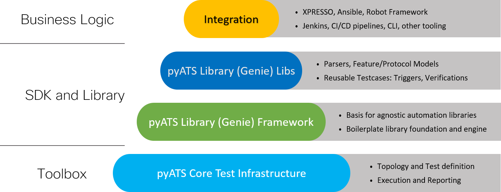

Introduction
=============================

The |getstartedguide| introduces you to the features and functionality of the |pyATS| solution for network test automation. Designed for test script developers and network engineers, this guide will help you to get up and running with |pyATS| and the |library|.

What is the |pyATS| ecosystem?
-------------------------------------
|pyATSbold| and the |librarybold| together define an ecosystem that streamlines and standardizes how you set up and run automated network tests. |pyATS| and the |library| provide sanity, feature, solution, system, and scale test automation for products that range from routers and switches to access points, firewalls, and cable CPEs.

Originally developed for internal Cisco engineers, the |pyATS| ecosystem is at the core of Cisco's Test Automation Solution. It's currently used 

* by more than **3000** internal Cisco engineers and developers
* and :question:`nnnn` external network engineers,
* for more than **2 million** test runs every month.

The |pyATS| ecosystem empowers your team to create and run consistent, repeatable, iterative, and reusable tests. |pyATS| provides the test framework, and the |library| offers ready-to-use test components. 

.. tip:: The |pyATS| ecosystem is available under Apache License Version 2.0

The following diagram describes the ecosystem in more detail :question:`needs to be updated`.

The |pyATS| ecosystem can learn and profile an entire feature's configuration and operational status. For example, with just a few commands, you can profile your system before and after a configuration change and get a detailed summary of exactly what changed.

What is |pyATS|?
^^^^^^^^^^^^^^^^
|pyATSbold| is the test framework foundation for the ecosystem. |pyATS| specializes in data-driven and reusable testing for Agile, rapid development iterations.

This powerful, highly-pluggable Python framework enables developers to start with small, simple and linear test cases, and then scale up to large, complex and asynchronous test suites.

What is the |library|
^^^^^^^^^^^^^^^^^^^^^^
The |librarybold| is a Python library that provides all the tools needed for network test automation :question:`is this true?`, including

* a simple command line interface (no Python knowledge needed)
* a pool of reusable test cases, and
* a Pythonic library for more complex scripting. :question:`We've already described the library itself as Pythonic, and as containing libraries. Can we reword any of this?`

Key benefits of |pyATS|
-----------------------
The |pyATS| ecosystem provides an agnostic infrastructure for rapid test development and execution. All OS/Platform and management protocol support is defined and injected through plugins, library implementations, and extensions. This includes support for third-party platforms and protocols. 

Network engineers and NetDevOps can be productive day one with the |library|'s readily available, holistic, and model-driven :question:`libraries`, which

* facilitate rapid development
* encourage the use of re-usable tests, and 
* simplify how you write and execute test automation scripts.

Script developer key benefits
^^^^^^^^^^^^^^^^^^^^^^^^^^^^^^^^^^^^^

* Parse device output for stateful validation.
* Re-use any of the available test cases.
* Connect to devices over CLI, NETCONF, or RESTCONF.
* Use a single, cross-platform script instead of having to modify multiple scripts.
* Verify CLI outputs with YANG and XML outputs.

Network engineer key benefits
^^^^^^^^^^^^^^^^^^^^^^^^^^^^^^

* Connect to devices and make sure that they are up, running and pingable.
* Retrieve information about the network state.
* Take before and after snapshots of the network, and then compare them.
* Parse device output and store a snapshot, and then automatically run the same commands at specified time intervals to compare the current and previous states.
* Use an available test case to verify a stable network topology after an image upgrade, for example.
* Perform typical actions such as ``Reload Devices``, ``Perform Switchover``, ``ShutNoShutBgp``, and ``ConfigUnconfigOspf``.

How does the |pyATS| ecosystem work?
----------------------------------------
|pyATSbold| provides a framework that standardizes:

* How network topologies are defined and modeled
* How to programmatically interact with devices (by means of connection :question:`libraries`)
* How test scripts are defined and executed
* How test runs are performed and how reports are generated

The |librarybold| builds on |pyATS| to provide:

* An easy-to-use Linux style command-line interface (CLI)
* Ready-to-use libraries that implement |pyATS| features
* Parsers, device, and feature configuration models, as well as operational status models
* Reusable test cases in the form of triggers and verifications
* The ability to build a test suite elastically through the use of YAML-based datafiles
* A mechanism for modeling network device features

See also...
*a list of relevant links once we know what these are*

* link 1
* link 2
* link 3

