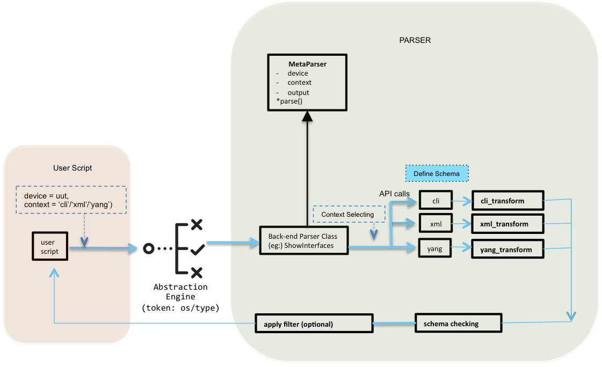

.. _write-parser:

Write a parser
======================
This topic describes why and how to write your own parsers to meet your network automation requirements. 

.. tip:: Remember to share your new parser with the rest of the |pyATS| user community. See the topic :ref:`contribute` for more information.

What is a parser?
-----------------

.. include:: ../definitions/def_parser.rst
    :start-line: 3

* For a basic introduction to the |library| parsers, see the topic :ref:`parse-output`.
* For more information about the ``metaparser`` package, see the topic `Metaparser Package <https://pubhub.devnetcloud.com/media/genie-metaparser/docs/index.html#genie-metaparser-package>`_.

Why write a parser?
-------------------
The |library| provides you with many out-of-the box `parsers <https://pubhub.devnetcloud.com/media/genie-feature-browser/docs/#/parsers>`_ for use with the most frequently-used Cisco show commands and OS/platform combinations. You can tailor these parsers by `excluding specific <https://pubhub.devnetcloud.com/media/genie-docs/docs/cookbooks/parsers.html?highlight=parser%20exclude#get-exclude-keys-for-a-parser-python>`_ keys from the parsed output. 

But if you want to customize a parser, or if you need to parse output for a feature that does not yet have a |library| model, you can easily write your own parser.

How the |library| parsers work
------------------------------
Each parser performs three main actions:

1. Run a show command and collect the device output.
2. "Loop" over (read) each line of output data.
3. Look for patterns in the output, and add any matching patterns to a Python dictionary.

The result is standardized, *structured* output that works with network automation scripts, regardless of OS or communication protocol.

The following sections describe this process in more detail.

.. _pattern-matching

Pattern matching
^^^^^^^^^^^^^^^^
The |library| parsers look for specific patterns in the device output and then structure the output as a set of key-value pairs. When you write a parser, you specify the patterns that you want the parser to match. For example, the ``show interfaces`` parser looks for patterns and returns the information in JSON format as a set of key-value pairs. as shown in the following example::

 {
  "GigabitEthernet1": {
    "arp_timeout": "04:00:00",
    "arp_type": "arpa",
    "auto_negotiate": true,
    "bandwidth": 1000000,
    ...

The |library| parsers use regular expressions (regex) to match patterns in the device output. Regular expressions are the backbone of all parsers, so you must know how to use them before you can write a parser.

The following references provide detailed information about how to use regular expressions:

* https://www.learnpython.org/en/Regular_Expressions
* https://regexone.com/references/python
* https://www.dataquest.io/blog/regex-cheatsheet/ 

The following online tools can help you build and test Python regular expressions:

* https://pythex.org/
* https://regex101.com/

|library| parser packages
^^^^^^^^^^^^^^^^^^^^^^^^^
The |library| uses the following two packages to parse (pattern match) device output data (text):

#. The ``genie.metaparser`` (Metaparser) core package ensures that each parser returns a fixed data structure based on the parser's :ref:`schema <schema>` (definition of the key-value pairs).
 
#. The ``genie.libs.parser`` package contains Python classes that parse device data using regular expressions. Different parser classes parse output from different protocols, such as CLI, XML, NETCONF, and YANG. Each parser has an associated schema that defines the data structure of the parsed output, so that the data structure is the same regardless of the protocol.

The following illustration shows how the Metaparser and parser classes work together to standardize parsed output.

.. _schema:

Create a parser schema
----------------------
A schema defines the key-value pairs stored in the Python dictionary that a parser creates. 

Example of a schema
^^^^^^^^^^^^^^^^^^^
You can see all of the available parser schemas on the `Parsers List website <https://pubhub.devnetcloud.com/media/genie-feature-browser/docs/#/parsers>`_.

1. At the top of the page, search for a show command, such as :monospace:`show interfaces`.
2. Select an OS, in this example, **IOSXE**.
3. Select **show interfaces**, and then scroll down to the IOSXE schema.

The following illustration shows part of the schema. **Optional** indicates keys that are not always included in the expected output.

.. image:: ../images/schema_example.png

Create a schema based on a model
^^^^^^^^^^^^^^^^^^^^^^^^^^^^^^^^
#. In a web browser, go to the `list of models <https://pubhub.devnetcloud.com/media/genie-feature-browser/docs/#/models>`_ on which you can base a new parser schema.

#. For this example, select **interface**, and then select **MODEL** to open a PDF file that contains the interface model.

#. Navigate to the **Interface Ops structure** section.

   .. image:: ../images/ops_structure.png
      :scale: 50 %

   |br| |br| *Result*: The ops structure lists the keys that you can use to create your own parser schema. |br| |br|  

#. In a text editor, define the schema class, and then add the keys that you want your parser to return, as shown in the following example. Use JSON format and save the file as a :monospace:`*.py` file.

   .. code-block:: python

    class ShowInterfacesSchema(MetaParser):
    """schema for show interfaces
                  show interfaces <interface>"""

    schema = {
            Any(): {
                'oper_status': str,
                Optional('line_protocol'): str,
                'enabled': bool,
                Optional('connected'): bool,
                Optional('description'): str,
                'type': str,
                ...

   .. note:: You must specify the value type, such as integer, string, boolean, or list.
   
   You can see `the complete parser file on GitHub <https://github.com/CiscoTestAutomation/genieparser/blob/master/src/genie/libs/parser/iosxe/show_interface.py#L178>`_. 

Create a schema without a model
^^^^^^^^^^^^^^^^^^^^^^^^^^^^^^^
If you want to create a new schema, you can identify the keys that you need in a number of ways, including:

* Use the ``show`` command output.
* Use the XML output option with a ``show`` command to display the output as key-value pairs.
* Use the YANG data model to identify the relevant keys.

Identify keys from the show command
***********************************
For this example, :download:`download the zip file <mock_parser.zip>` and extract the contents to a directory of your choice, such as :monospace:`mock_parser`.

#. Go to the directory that contains the extracted files::

    $ cd mock_parser

#. In your Python interpreter, load the :term:`testbed YAML file`, and connect to a device.

   .. code-block:: python

    from genie.testbed import load
    testbed = load('mock_parser.yaml')
    dev = testbed.devices['iosxe1']
    dev.connect()

#. Execute the ``show interfaces`` command.

   .. code-block:: python

    dev.execute('show interfaces')

   *Result*: The system displays the unparsed output. The following example show some of the output that you can use to identify keys for your parser::

    GigabitEthernet1 is up, line protocol is up
        Hardware is CSR vNIC, address is 0800.2729.3800 (bia 0800.2729.3800)
        Internet address is 10.0.2.15/24
        MTU 1500 bytes, BW 1000000 Kbit/sec, DLY 10 usec,
            reliability 255/255, txload 1/255, rxload 1/255
        Encapsulation ARPA, loopback not set
        Keepalive set (10 sec)
        Full Duplex, 1000Mbps, link type is auto, media type is Virtual
        output flow-control is unsupported, input flow-control is unsupported
        ARP type: ARPA, ARP Timeout 04:00:00
        Last input 00:00:00, output 00:00:00, output hang never
        Last clearing of "show interface" counters never

#. Check the indentation in the output. The indentation tells you about the parent-child relationship of the keys. 

   .. note:: Remember to use the indentation (parent-child relationships) to ensure that values don't overwrite other values at the same level. In this example, the keys for :monospace:`interface_name` are indented so that the :monospace:`mac_address`, for example, won't be overwritten by the mac_address of a different interface.

   Your schema might look something like this:

   .. code-block:: python

        'interfaces': {
            'interface_name': {
                'oper_status': str,
                'line_protocol': str,
                'hardware': str,
                'mac_address': str,
                ... 

 

#. You can also check for ways to group the data based on counters, input and output, as well as other statistics. For the following output:

   .. code-block:: python

        4243 packets input, 361948 bytes, 0 no buffer
        Received 0 broadcasts (0 IP multicasts)
        0 runts, 0 giants, 0 throttles
        0 input errors, 0 CRC, 0 frame, 0 overrun, 0 ignored
        0 watchdog, 0 multicast, 0 pause input
        3616 packets output, 1637917 bytes, 0 underruns
        0 output errors, 0 collisions, 0 interface resets
        0 unknown protocol drops
        0 babbles, 0 late collision, 0 deferred
        0 lost carrier, 0 no carrier, 0 pause output
        0 output buffer failures, 0 output buffers swapped out

   Your schema could be::

    'counters': {  # categorize the value as 'counters'
        'input': {   # categorize the 'input' related values
            'packets': int,
            'bytes': int,
            
        },
        'output': {
            'packets': int,
            'bytes': int,
        }

Identify keys from XML output
******************************
NXOS device ``show`` commands have an XML option that formats the output as key-value pairs. If you have an IOSXE or IOSXR device, you can usually find a similar NXOS command to run so that you can see the XML output:

.. code-block:: text

 nx-osv9000-1# show interface | xml

*Result*::

    <?xml version="1.0" encoding="ISO-8859-1"?>
    <nf:rpc-reply xmlns="http://www.cisco.com/nxos:1.0:if_manager" xmlns:nf="urn:iet
    f:params:xml:ns:netconf:base:1.0">
    <nf:data>
    <show>
    <interface>
        <__XML__OPT_Cmd_show_interface_quick>
        <__XML__OPT_Cmd_show_interface___readonly__>
        <__readonly__>
        <TABLE_interface>
            <ROW_interface>
            <interface>mgmt0</interface>
            <state>up</state>
            <admin_state>up</admin_state>
            <eth_hw_desc>Ethernet</eth_hw_desc>
            <eth_hw_addr>5e01.c005.0000</eth_hw_addr>
            <eth_bia_addr>5e01.c005.0000</eth_bia_addr>
            <eth_ip_addr>10.0.0.0</eth_ip_addr>

In this example, your schema could include the keys :monospace:`state`, :monospace:`admin_state`, :monospace:`eth_hw_desc`, and others.

Identify keys from the YANG data model
**************************************

#. Install the ``pyang`` package in your virtual environment::

    pip install pyang

#. Clone the git repository for the YANG model::

    git clone https://github.com/YangModels/yang.git

#. Look for the latest model (at the time of writing, this is |br| :monospace:`./yang/experimental/ietf-extracted-YANG-modules/ietf-arp@2019-02-21.yang`)::

    find . | grep arp

#. View the model and identify the keys::

    pyang -f tree ./yang/experimental/ietf-extracted-YANG-modules/ietf-arp@2019-02-21.yang

   *Result*: You can see the YANG model with the keys and data types::

     module: ietf-arp
        +--rw arp
            +--rw dynamic-learning?   boolean

        augment /if:interfaces/if:interface/ip:ipv4:
            +--rw arp
            +--rw expiry-time?        uint32
            +--rw dynamic-learning?   boolean
            +--rw proxy-arp
            |  +--rw mode?   enumeration
            +--rw gratuitous-arp
            |  +--rw enable?     boolean
            |  +--rw interval?   uint32
            +--ro statistics
                +--ro discontinuity-time?    yang:date-and-time
                +--ro in-requests-pkts?      yang:counter32
                +--ro in-replies-pkts?       yang:counter32
                +--ro in-gratuitous-pkts?    yang:counter32
                +--ro out-requests-pkts?     yang:counter32
                +--ro out-replies-pkts?      yang:counter32
                +--ro out-gratuitous-pkts?   yang:counter32
        augment /if:interfaces/if:interface/ip:ipv4/ip:neighbor:
            +--ro remaining-expiry-time?   uint32

Write a parser class with RegEx
--------------------------------
When you write a new parser class, you define the regular expressions used to match patterns in each line of the device output. The parser then adds the matched values as key-value pairs to a Python dictionary, as defined by the associated schema class. The parser class inherits from the schema class to ensure that the Python dictionary returned by the parser follows exactly the format of the defined schema. 

The following example shows a schema and parser class for the ``show lisp session`` command. As you can see, the schema and parser classes are within the same python file. Take a look at the example, and then we'll explain how it works.

.. code-block:: python

    # Metaparser
    from genie.metaparser import MetaParser
    from genie.metaparser.util.schemaengine import Any, Or, Optional
    
    # ==============================
    # Schema for 'show lisp session'
    # ==============================
    class ShowLispSessionSchema(MetaParser):
    
        ''' Schema for "show lisp session" '''
    
    # These are the key-value pairs to add to the parsed dictionary
        schema = {
            'vrf':
                {Any():
                    {'sessions':
                        {'total': int,
                        'established': int,
                        'peers':
                            {Any():
                                {'state': str,
                                'time': str,
                                'total_in': int,
                                'total_out': int,
                                Optional('users'): int,
                                },
                            },
                        },
                    },
                },
            }
    
    # Python (this imports the Python re module for RegEx)
    import re
    
    # ==============================
    # Parser for 'show lisp session'
    # ==============================
    
    # The parser class inherits from the schema class
    class ShowLispSession(ShowLispSessionSchema):
    
        ''' Parser for "show lisp session"'''
    
        cli_command = 'show lisp session'
    
        def cli(self, output=None):
            if output is None:
                out = self.device.execute(self.cli_command)
            else:
                out = output
    
            # This is the dictionary object, indicated by {}
            parsed_dict = {}
    
            # This is the python regex, re.compile compiles the regex pattern into a regex object, 
            # and the object is then used to match patterns.
            
            # The regex for p1 matches the schema keys to the level of vrf sessions established
            p1 = re.compile(r'Sessions +for +VRF +(?P<vrf>(\S+)),'
                            ' +total: +(?P<total>(\d+)),'
                            ' +established: +(?P<established>(\d+))$')
    
            # The regex for p2 matches the lower-level patterns for each peer
            p2 = re.compile(r'(?P<peer>(\S+)) +(?P<state>(Up|Down)) +(?P<time>(\S+))'
                            ' +(?P<in>(\d+))\/(?P<out>(\d+)) +(?P<users>(\d+))$')
    
            # This defines the "for" loop, so that the parser reads each line of output
            for line in out.splitlines():
                line = line.strip()
    
                # ??? Sessions for VRF default, total: 3, established: 3
                m = p1.match(line)
                if m:
                    group = m.groupdict()
                    vrf = group['vrf']
                    vrf_dict = parsed_dict.setdefault('vrf', {}).\
                                setdefault(vrf, {}).setdefault('sessions', {})
                    vrf_dict['total'] = int(group['total'])
                    vrf_dict['established'] = int(group['established'])
                    continue
    
                # ??? 8.8.8.8                        Up         00:52:15        8/13     3
                m = p2.match(line)
                if m:
                    group = m.groupdict()
                    peer = group['peer']
                    peer_dict = vrf_dict.setdefault('peers', {}).setdefault(peer, {})
                    peer_dict['state'] = group['state'].lower()
                    peer_dict['time'] = group['time']
                    peer_dict['total_in'] = int(group['in'])
                    peer_dict['total_out'] = int(group['out'])
                    peer_dict['users'] = int(group['users'])
                    continue
    
            return parsed_dict

The following table describes the structure of the parser class in more detail.

.. csv-table:: Structure of a parser class
   :file: parser_class_structure.csv
   :header-rows: 1

.. note:: You need to know the patterns that you want to match before you write the parser class. These patterns can be some or all of the keys defined in the schema class.

Write a parser class with the parsergen package
-----------------------------------------------
The |library| ``parsergen`` package provides a one-step parsing mechanism that can parse dynamic tabular and non-tabular device output. The ``parsergen`` produces significantly fewer lines of code than standard parsing mechanisms.

The ``parsergen`` package is a generic parser for show commands. You can use the package to create a parser class for any given show command, and then reuse this class to create tests for any values found within the output. 

Using ``parsergen`` to create a parser class is particularly useful when you don't have a |library| model for a feature. In this example, we'll create a new parser class for the NXE/VXLAN platform.

#. In a Python interpreter, import the required |library| and Python functionality (``re`` is the Python regex functionality):

   .. code-block:: python

     from genie.testbed import load
     from genie import parsergen
     import re
     from pprint import pprint

#. Load the testbed, create the device object, and connect to the device:

   .. code-block:: python

     testbed = load('mock_parser.yaml')
     uut = testbed.devices['iosxe1']
     uut.connect()

#. Execute the show command and store the output in the variable ``output``:

   .. code-block:: python

    output = uut.device.execute('show nve vni')

   *Result*: You can see the tabular output::

    Interface  VNI        Multicast-group VNI state  Mode  BD    cfg vrf
    nve1       6010       N/A             Up         L2DP  1     CLI N/A
    nve2       6020       N/A             Up         L2DP  2     CLI N/A
    nve3       6030       N/A             Up         L2DP  3     CLI N/A

#. Now you can store a list of header names from the table as a variable. The names must exactly match the output:

   .. code-block:: python

    header = ['Interface', 'VNI', 'Multicast-group', 'VNI state', 'Mode', 'BD', 'cfg', 'vrf']

#. Use ``parsergen`` to parse the output, with the interface name as index 0. This process creates a Python dictionary of operational statistics per interface:

   .. code-block:: python

    result = parsergen.oper_fill_tabular(device_output=output, device_os='iosxe', header_fields=header, index=[0])

#. Print the value of the ``result`` object that contains the dictionary:

   .. code-block:: python

    pprint(result.entries)

   *Result*: Easy-to-read and easy-to-automate structured data:
   
   .. code-block:: text

    {'nve1': {'BD': '1',
            'Interface': 'nve1',
            'Mode': 'L2DP',
            'Multicast-group': 'N/A',
            'VNI': '6010',
            'VNI state': 'Up',
            'cfg': 'CLI',
            'vrf': 'N/A'},
    'nve2': {'BD': '2',
            'Interface': 'nve2',
            'Mode': 'L2DP',
            'Multicast-group': 'N/A',
            'VNI': '6020',
            'VNI state': 'Up',
            'cfg': 'CLI',
            'vrf': 'N/A'},
    'nve3': {'BD': '3',
            'Interface': 'nve3',
            'Mode': 'L2DP',
            'Multicast-group': 'N/A',
            'VNI': '6030',
            'VNI state': 'Up',
            'cfg': 'CLI',
            'vrf': 'N/A'}}

.. tip:: You can run all of these commands as a script. :download:`Download the attached zip file <parsergen_script.zip>`, extract the file to the same directory as your testbed YAML file, and then run the following command::

   (pyats) $ python3 parsergen_script.py

Create and execute a unit test
-------------------------------
If you want to contribute your new parser to the open-source |pyATS| feature libraries and components, you must attach unit test results for each parser that you want to contribute.

See the topic :ref:`contribute` for more details.

Make JSON is part of contributing a new parser, because it adds the new parser to the functionality on the web page that displays the list of available parsers.

See also...

* `Cisco Live DevNet workshop 2601 - pyATS/GENIE ops and parsers <https://github.com/RunSi/DEVWKS-2601>`_
* `Available parsers <https://pubhub.devnetcloud.com/media/genie-feature-browser/docs/#/parsers>`_