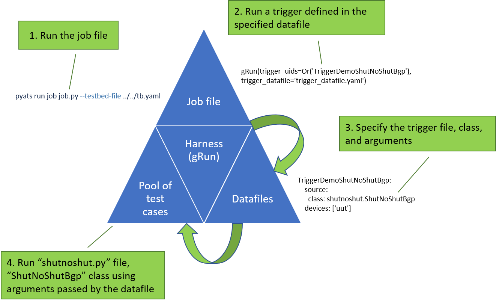

.. _write-trigger:

Write a trigger
===============
This topic describes how to write your own triggers so that you can use the |library| to meet your network automation requirements.

.. note:: The *Get Started with pyATS* guide, `Run a test case <https://pubhub.devnetcloud.com/media/pyats-getting-started/docs/quickstart/runtestcase.html#run-a-test-case>`_ section explains the concepts that you need to know before you begin to write a trigger.

Triggers, verifications, and test cases
---------------------------------------

.. include:: ../definitions/def_trigger.rst
   :start-line: 3

You can think of a trigger and its associated :term:`verifications <verification>` as a reusable |pyATS| test case. In |pyATS|, you embed triggers within your test script. With the |library|, you import and run the trigger as a Python library. Triggers make it easier to change the order of your test cases without having to write a new script.

Purpose of triggers
^^^^^^^^^^^^^^^^^^^
Triggers provide a way to:

* Make tests independent of specific devices, topologies, and hostnames.
* Remove dependencies on one specific configuration.
* Make the logs readable, so that you can easily understand why tests fail:

  * Divide the test into separate, specific actions.
  * Log the right information at the right level of detail. |br| |br|

* Reuse a test in combination with other tests.
* Grow the |library| "pool" of triggers to make future automation easier!

How triggers and verifications work
^^^^^^^^^^^^^^^^^^^^^^^^^^^^^^^^^^^
The |library| components work together so that you can:

* Pick and choose the test cases (triggers and verifications) that you need.
* Use the |library| infrastructure (``gRun``) to create a dynamic test suite.

.. tip::  Nothing is hard-coded, everything is reusable, and the flow is exactly as you determine.

To run triggers using the ``harness``, you need at least three files, as described in the following table.

.. csv-table:: Files required to run triggers
    :header: "File type", "Format", "Description"
    :widths: 25 25 50

    "Trigger", "Python (.py)", "Defines the trigger class or classes."
    "Trigger datafile", "YAML (.yaml)", "Lists the triggers and arguments to pass to each trigger."
    "Job file", "Python (.py)", "Imports ``gRun`` functionality from the ``harness`` package. Identifies which triggers to run from the specified datafile."

The following diagram shows how the triggers, datafiles, and job files interact when you use the |library| harness to automate test cases.

Write your own trigger
----------------------

Example of a trigger file
^^^^^^^^^^^^^^^^^^^^^^^^^
Note that:

1. A trigger is a Python class. 
2. One Python file can have more than one trigger class.
3. Triggers inherit from the base :monospace:`Trigger` class, which contains common setup and cleanup tasks and verifications.

Take a look at the following example, and then we'll explain it step by step. This example shows a simple trigger to shut and unshut BGP on the device defined as :monospace:`uut` in the testbed YAML file.

.. code-block:: python

    import time
    import logging
    from ats import aetest

    ### Code replaced by using Verification!
    #from genie.utils.diff import Diff
    ###
    from genie.harness.base import Trigger

    log = logging.getLogger()

    class ShutNoShutBgp(Trigger):
        '''Shut and unshut bgp'''

        @aetest.setup
        def prerequisites(self, uut):
            '''Figure out if bgp is configured and up'''

            # To verify if bgp is configured
            output = uut.parse('show bgp process vrf all')

            # Check if there is a bgp_id
            # And it is running
            if not 'bgp_tag' in output:
                # No Bgp! So can't do
                self.skipped("No Bgp is configured for "\
                            "device '{d}'".format(d=uut.name))

            # Now see if its up
            if 'bgp_protocol_state' not in output or\
            output['bgp_protocol_state'] != 'running':
                self.skipped("Bgp is not operational on "
                            "device '{d}'".format(d=uut.name))

            # Keep track of it
            self.bgp_id = output['bgp_tag']
            ### Code replaced by using Verification!
            #self.initial_output = output
            ###

        @aetest.test
        def shut(self, uut):
            '''Shut bgp'''
            uut.configure('''\
    router bgp {id}
    shutdown'''.format(id=self.bgp_id))

        @aetest.test
        def verify(self, uut):
            '''Verify if the shut worked'''
            # Check if there is a bgp_id
            # And it is running
            output = uut.parse('show bgp process vrf all')
            if output['bgp_tag'] != self.bgp_id:
                self.failed("Bgp id {bgp_id} is not showing anymore in the "
                            "output of the cmd, this is "
                            "unexpected!".format(bgp_id=self.bgp_id))

            # Now see if its down
            if output['bgp_protocol_state'] != 'shutdown':
                self.failed("Shut on Bgp {bgp_id} did not work as it is not "
                            "shutdown".format(bgp_id=self.bgp_id))

        @aetest.test
        def unshut(self, uut):
            '''Shut bgp'''
            uut.configure('''\
    router bgp {id}
    no shutdown'''.format(id=self.bgp_id))

        @aetest.test
        def verify_recover(self, uut, wait_time=20):
            '''Figure out if bgp is configured and up'''
            ### Code replaced by using Verification!
            #log.info('Sleeping for {w}'.format(w=wait_time))
            #time.sleep(wait_time)
            ###

            # Check if there is a bgp_id
            # And it is running
            output = uut.parse('show bgp process vrf all')
            if output['bgp_tag'] != self.bgp_id:
                self.failed("Bgp id {bgp_id} is not showing anymore in the "
                            "output of the cmd, this is "
                            "unexpected!".format(bgp_id=self.bgp_id))

            # Now see if its down
            if output['bgp_protocol_state'] != 'running':
                self.failed("Reconfigure of Bgp {bgp_id} did not work as it is not "
                            "running".format(bgp_id=self.bgp_id))

            ### Code replaced by using Verification!
            #diff = Diff(self.initial_output, output)
            #diff.findDiff()
            #if diff.diffs:
            #    self.failed('Unexpected change has happened to our device state '
            #                '\n{d}'.format(d=diff))
            ### 

Choose or create a trigger
^^^^^^^^^^^^^^^^^^^^^^^^^^

in the job file, gRun creates a test suite